[](https://cloud.drone.io/atomlong/AutoApi)
[](https://wakatime.com/badge/github/atomlong/AutoApi)
# AutoApi v7.0 ———— E5自动续期
AutoApi系列：AutoApi(v1.0)~~、~~AutoApiSecret(v2.0)~~、~~AutoApiSR(v3.0)~~、~~AutoApiS(v4.0)~~、~~AutoApiP(v5.0)~~、AutoApi(v6.0) 1

## 说明 ##
* E5自动续期程序，但是**不保证续期**
* 在Drone CI中设置每天自动调用
* 调用api保活：
     * 查询系api：onedrive,outkook,notebook,site等
     * 创建系api: 自动发送邮件，上传文件，修改excel等
     
### 相关 ###
* AutoApi: https://github.com/Hostage-02/AutoApi
* **错误及解决办法/续期相关知识/更新日志**：https://github.com/Hostage-02/AutoApi
   * 大部分错误说明已更新进程序，详细请运行后看action日志报告
* 视频教程：
   * B站：https://www.bilibili.com/video/BV185411n7Mq/

## 步骤 ##
* 准备工具：
   * E5开发者账号（**非个人/私人账号**）
       * 管理员号 ———— 必选 
       * 子号 ———— 可选 （不清楚微软是否会统计子号的活跃度，想弄可选择性补充运行）    
   * rclone软件，[下载地址 rclone.org ](https://downloads.rclone.org/v1.56.0/rclone-v1.56.0-windows-amd64.zip)，(windows 64）
   * 教程图片看不到请科学上网
   
* 步骤大纲：
   * 微软方面的准备工作 （获取应用id、密码、密钥）
   * GIHTHUB方面的准备工作  （获取Github密钥、设置secret）
   * 试运行
   
#### 微软方面的准备工作 ####

* **第一步，注册应用，获取应用id、secret**

    * 1）点击打开[仪表板](https://aad.portal.azure.com/)，左边点击**所有服务**，找到**应用注册**，点击+**新注册**
    
     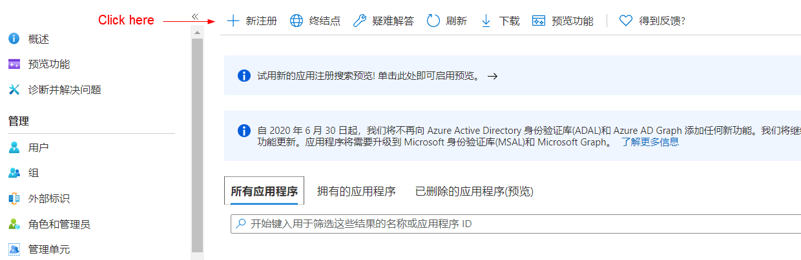
    
    * 2）填入名字，受支持账户类型前三任选，重定向填入 http://localhost:53682/ ，点击**注册**
    
    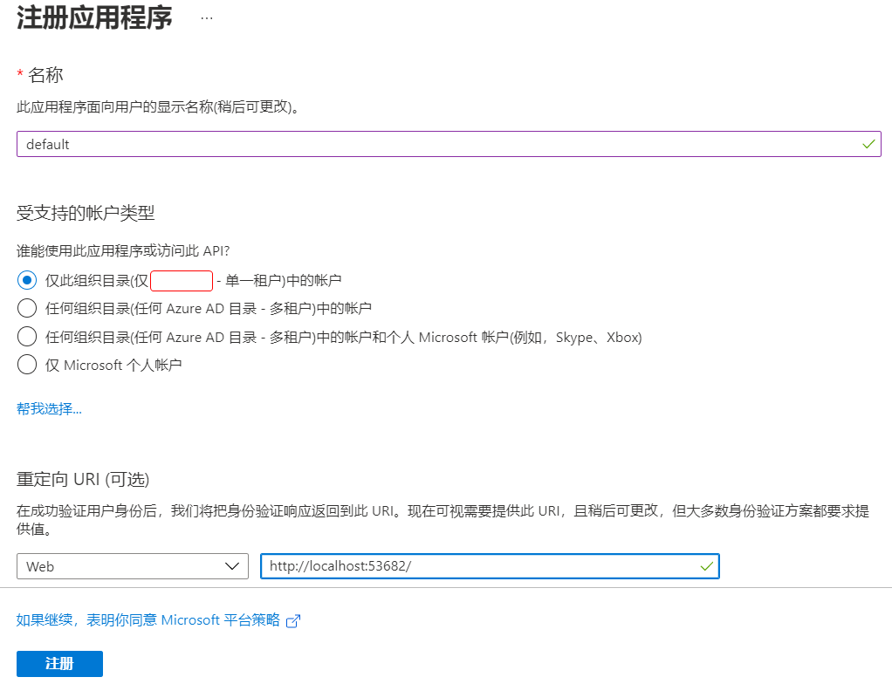
    
    * 3）复制应用程序（客户端）ID到记事本备用(**获得了应用程序ID**！)，点击左边管理的**证书和密码**，点击+**新客户端密码**，点击添加，复制新客户端密码的**值**保存（**获得了应用程序密码**！）
    
    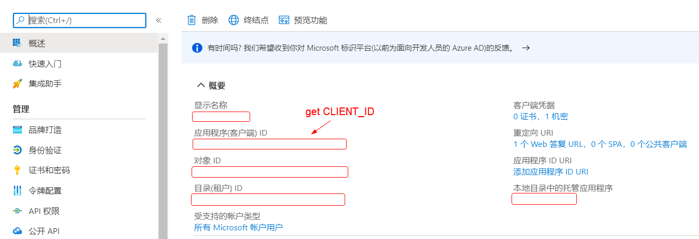
    
    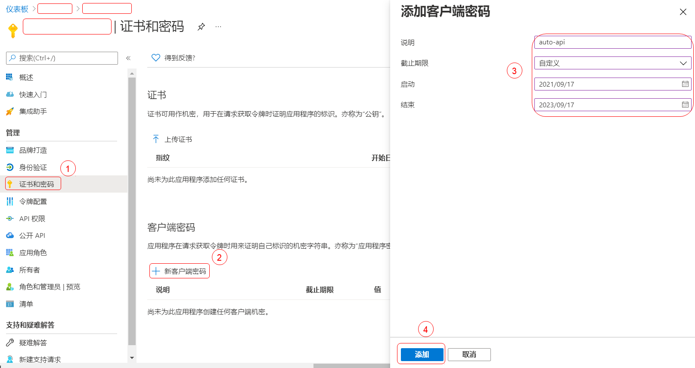
    
    * 4）点击左边管理的**API权限**，点击+**添加权限**，点击常用Microsoft API里的**Microsoft Graph**(就是那个蓝色水晶)，
    点击**委托的权限**，然后在下面的条例选中下列需要的权限，最后点击底部**添加权限**
    
    **赋予api权限的时候，选择以下12个**
  
                Calendars.ReadWrite、Contacts.ReadWrite、Directory.ReadWrite.All、
                
                Files.ReadWrite.All、MailboxSettings.ReadWrite、Mail.ReadWrite、
                
                Mail.Send、Notes.ReadWrite.All、People.Read.All、
                
                Sites.ReadWrite.All、Tasks.ReadWrite、User.ReadWrite.All
    
    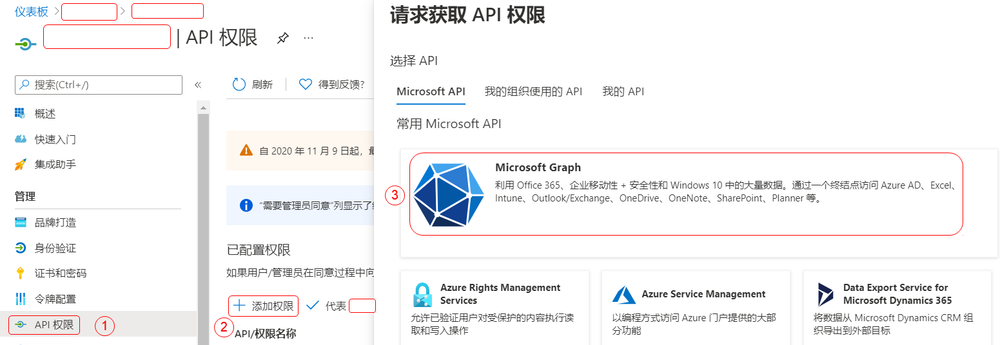
    
    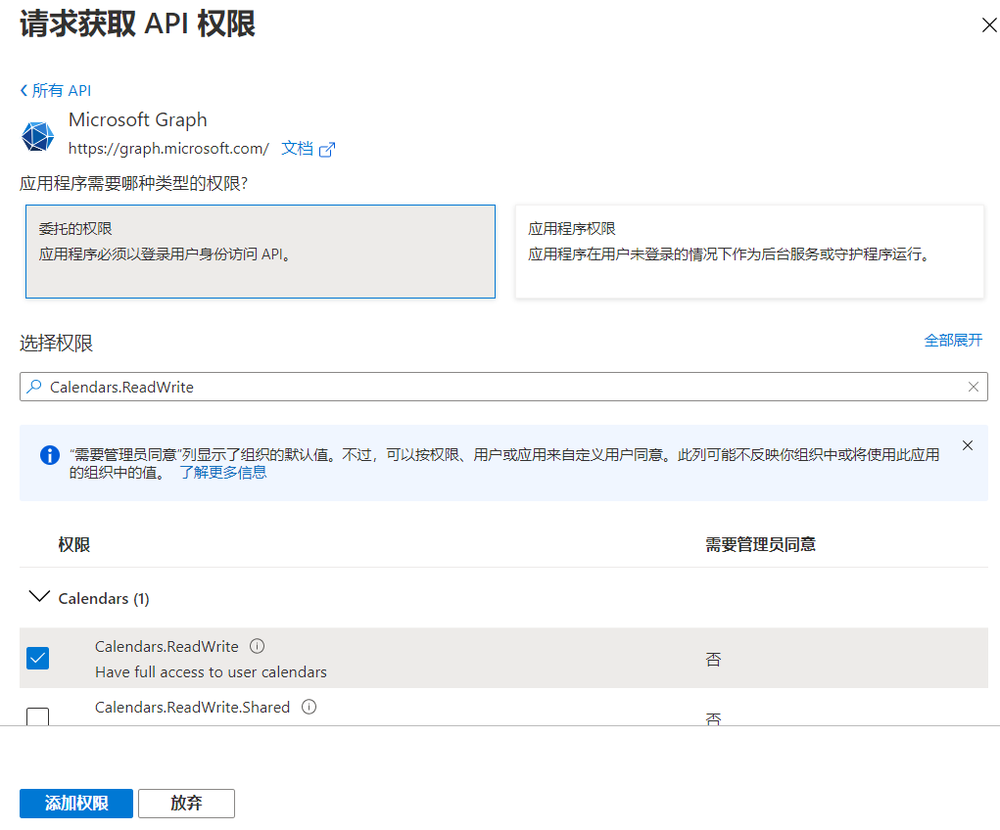
     
    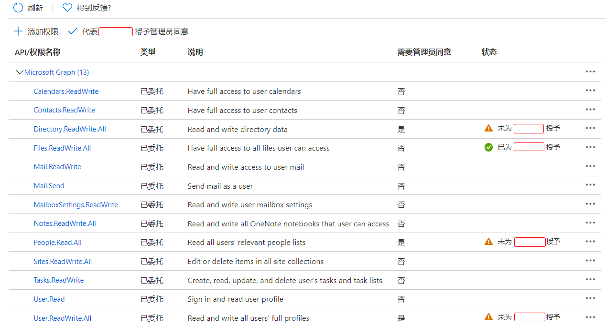
    
    * 5）添加完自动跳回到权限首页，点击**代表授予管理员同意**
         
         如若是**子号**运行，请用管理员账号登录[仪表板](https://aad.portal.azure.com/)找到**子号注册的应用**，点击“代表管理员授权”。 
    
    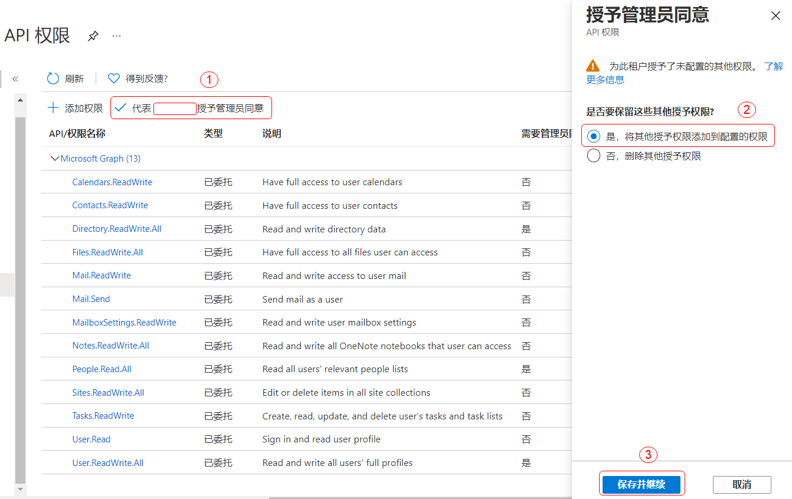
    
* **第二步，获取refresh_token(微软密钥)**

    * 1）rclone.exe所在文件夹，shift+右键，在此处打开powershell，输入下面**修改后**的内容，回车后跳出浏览器，登入e5账号，点击接受，回到powershell窗口，看到一串东西。
           
                rclone authorize "onedrive" "应用程序(客户端)ID" "应用程序密码"
               
    * 2）在那一串东西里找到 "refresh_token"：" ，从双引号开始选中到 ","expiry":2021 为止（就是refresh_token后面双引号里那一串，不要双引号），如下图，右键复制保存（**获得了微软密钥**）
    
    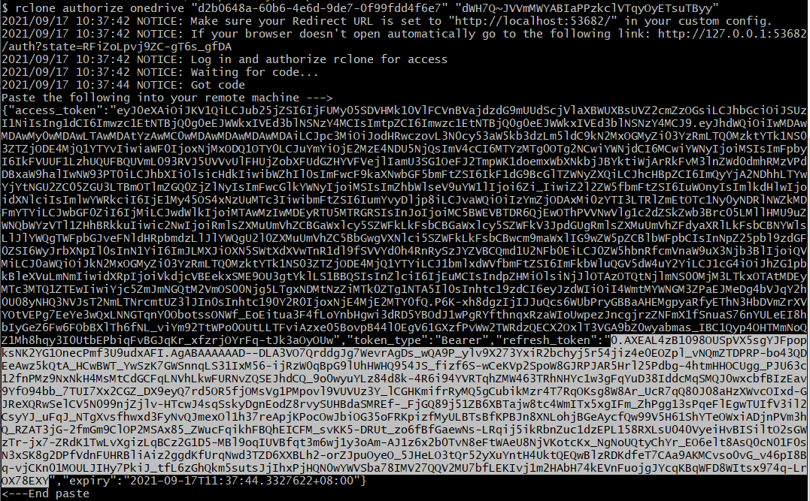
    
 ____________________________________________________
 
 #### DRONE方面的准备工作 ####

 * **第一步，fork本项目**
 
     登陆/新建github账号，回到本项目页面，点击右上角fork本项目的代码到你自己的账号，然后你账号下会出现一个一模一样的项目，接下来的操作均在你的这个项目下进行。
     
     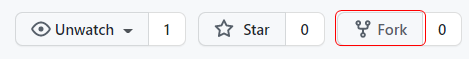
     
 * **第二步，激活仓库**
 
    * 1）进入[Drone Cloud](https://cloud.drone.io/login)，输入Github用户名(或邮箱)和密码；
	
	* 2）从[帐户页面](https://cloud.drone.io/account)中获知DRONE_SERVER和DRONE_TOKEN两个变量;
	
	* 3）在[Dashboard](https://cloud.drone.io)中的REPOSITORIES列表中找到本仓库，点击进入仓库的设置页面。
	点击ACTIVE REPOSITORY按钮激活本仓库。
	
	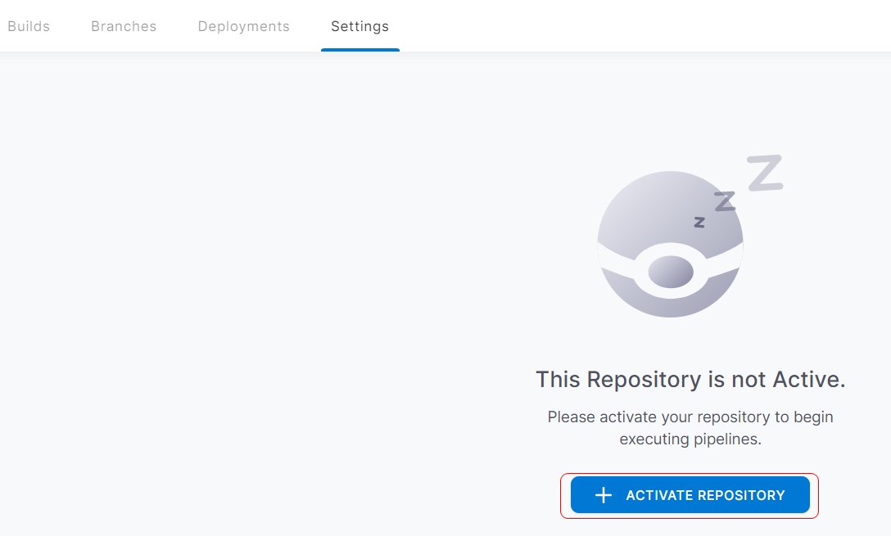
  
 * **第三步，新建secret**
 
    * 1）在Settings页面的左边选择Secrets，点击NEW SECRET按钮，新建一个变量。
   
    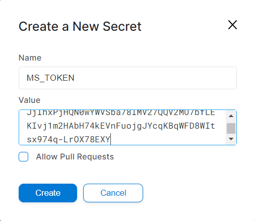
    
	添加如下所有变量
     **(以下填入内容注意前后不要有空格空行)**
	 
	 DRONE_SERVER
	 ```shell
     drone服务器地址
     ```
     DRONE_TOKEN
     ```shell
     drone密钥
     ```
     MS_TOKEN
     ```shell
     微软密钥（第二步获得的refresh_token）
     ```
     CLIENT_ID
     ```shell
     应用程序ID (第一步获得)
     ```
     CLIENT_SECRET
     ```shell
     应用程序密码 (第一步获得)
     ```
     CITY
     ```shell
     城市 (例如Beijing,自动发送天气邮件要用到)
     ```
     EMAIL
     ```shell
     收件邮箱 (自动发送天气邮件要用到)
     ```


________________________________________________

#### 试运行 ####

   * 1）点击上栏的Builds进入运行页面。该页面显示SUMMARY和EXECUTIONS。
   
       点击进入一个EXECUTION，会看到左边至少有4个步骤，一个是默认的clone，一个run-read，一个run-write，一个update-token。
       
         工作流程说明
			 clone:         下载源代码
			 run-read:      查询系api
             run-write:     创建系api
             update-token:  微软密钥更新
             
       每个步骤名称前面的绿色√图标标识该步骤执行成功。
	   
	   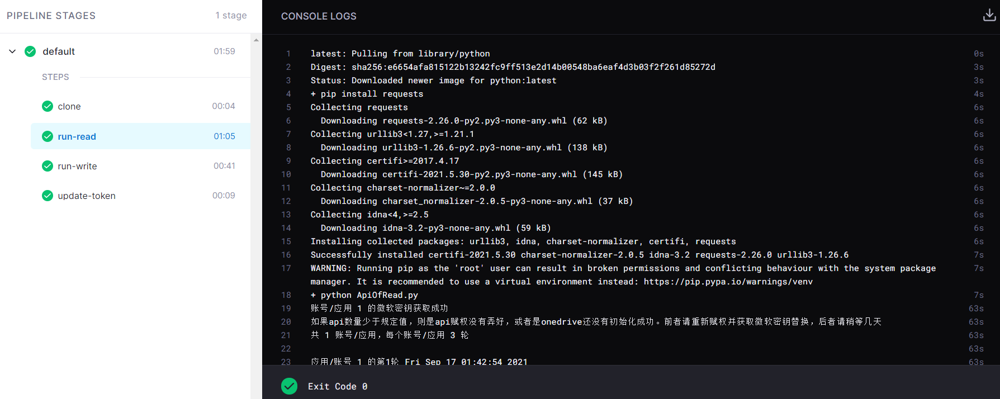
   
   * 2）在Builds页面中点击右上角的NEW BUILD启动新的运行
   
   
### 教程完 ###
    
#### 多账号/应用支持 ####

   如果想输入第二账号或者应用，请按上述步骤获取**第二个应用的id、密码、微软密钥：**
 
   再按以下步骤：
 
   1)增加secret
 
   依次点击页面上栏右边的 Setting -> 左栏 Secrets -> 右上 NEW SECRET，新增加secret：APP_NUM、MS_TOKEN_2、CLIENT_ID_2、CLIENT_SECRET_2
 
   APP_NUM
   ```shell
   账号/应用数量(现在例如是两个账号/应用，就是2 ；3个账号就填3，日后如果想要增加请修改APP_NUM)
   ```
   MS_TOKEN_2
   ```shell
   第二个账号的微软密钥（第二步refresh_token），（第三个账号/应用就是MS_TOKEN_3，如此类推）
   ```
   CLIENT_ID_2
   ```shell
   第二个账号的应用程序ID (第一步获取),（第三个账号/应用就是CLIENT_ID_3，如此类推）
   ```
   CLIENT_SECRET_2
   ```shell
   第二个账号的应用程序密码 (第一步获取),（第三个账号/应用就是CLIENT_SECRET_3，如此类推）
   ```
   
   2)修改.drone.yml（**超过3个账号需要更改，3个及以下暂时不用修改文件，忽略这一步**）
    
   yml文件我已经注明了，看着改就行，我已经写入3个账号模板了，跟着复制粘贴很简单的（没有找到比较好的自动方案）
  
#### 超级参数设置 ####
 
   ApiOfRead.py ， ApiOfWrite.py 文件第11左右行各有个config，具体参数设置已在文件里说明
   
   包括账号api的随机延时，api随机排序，每次轮数等参数
